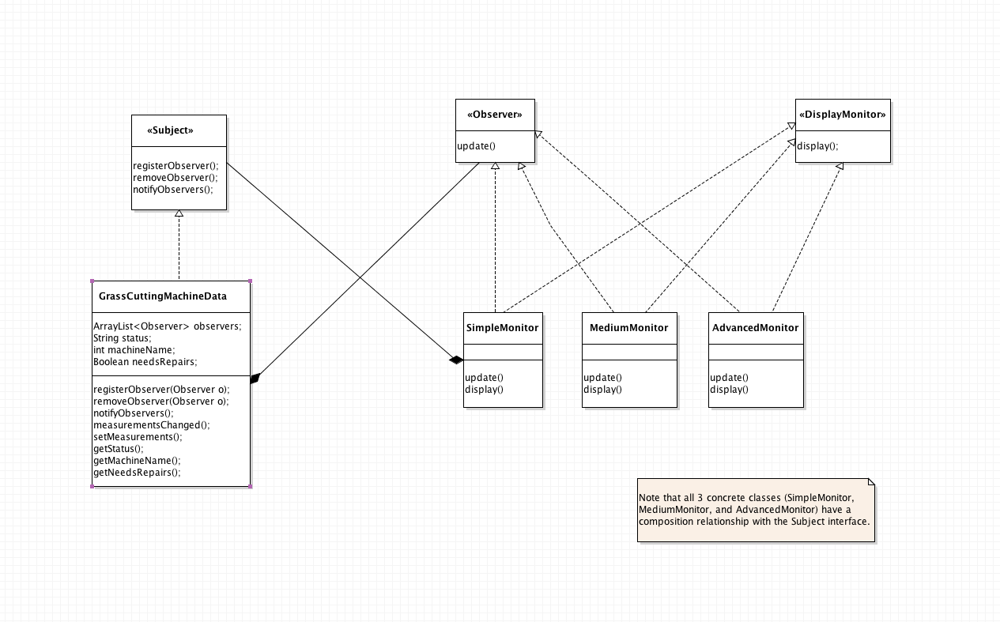
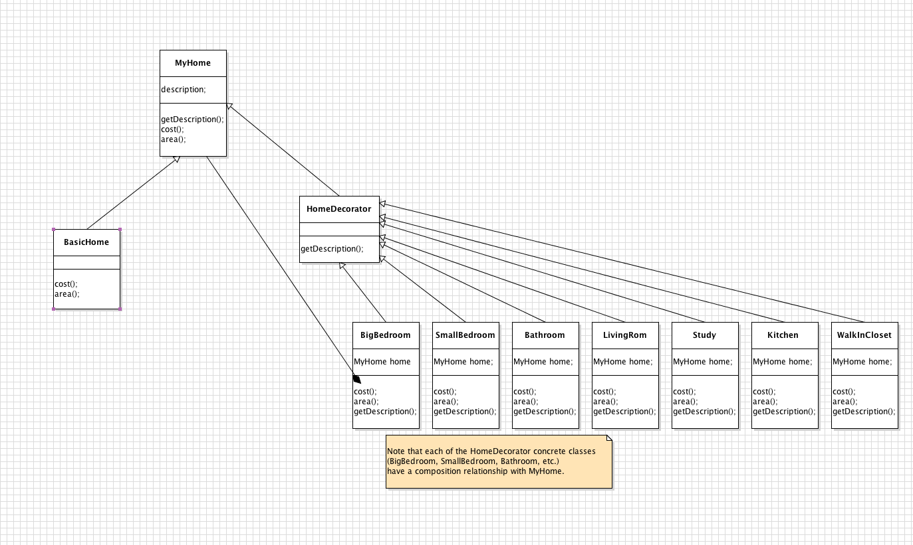

# OO Software Design Patterns
These examples of Software Design Patterns are written in Java and are inspired by the Head First Design Patterns Book. 

* **Strategy Pattern**: take elements that vary and encapsulate them them so that changes in these components won't affect the rest of the code. This allows the program to be more maintainable, where it is easier to code and there will be less unintended consequences. Wrap up an objects state and behavior into one class and make accessible via getters/setters and modifiers. Also, program to an interface, where an object's type is assigned a reference to a super-type (interface or abstract class), rather than an implementation (concrete class), where the behavior is set statically at compilation. This allows dynamic behavior at runtime. This example is a game where characters play guitar, and the types of guitar vary. The game character delegates the task of playing guitar to the appropriate interface.

 

* **Observer Pattern**: observer objects subscribe to observe a subject object. When the subject's state changes, it notifies its observers. This example consists of different monitors that subscribe to observe a machine. If the machine status changes, it notifies the list of observers. The design pattern "strive for loosely coupled designs between objects that interact" is followed so that objects can interact with each other and have little knowledge of each other. Interdependencies between objects are minimized.   

* **Decorator Pattern**: A decorator object wraps another object to provide additional functionality dynamically at runtime. In this example, a home construction company builds homes with different specifications. This allows an alternative to using subclasses. 

