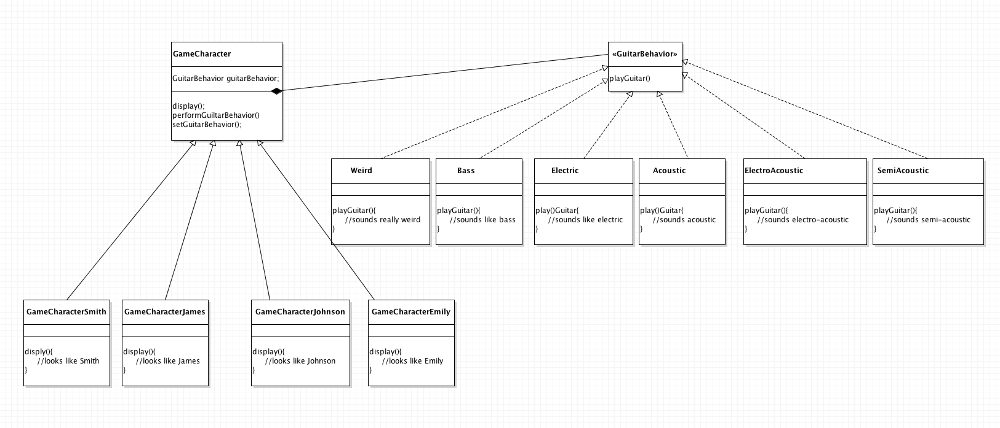

# OO Software Design Patterns
These examples of Software Design Patterns are written in Java and are inspired by the Head First Design Patterns Book. 

* **Strategy Pattern**: take elements that vary and encapsulate them them so that changes in these components won't affect the rest of the code. This example is a game where characters play guitar, and the types of guitar vary. The game character delegates the task of playing guitar to the appropriate interface.

 

* **Observer Pattern**: